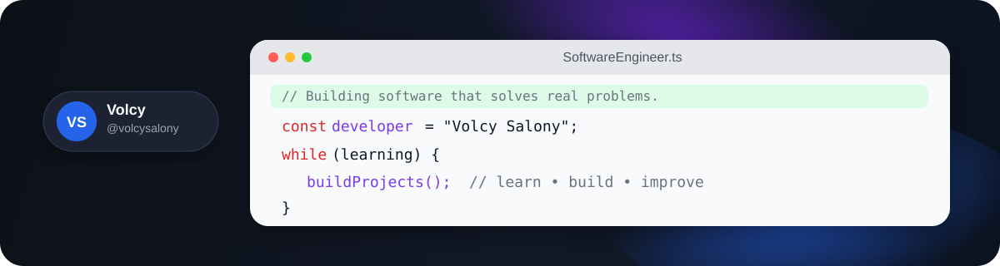

<h1 align="left">Olá, eu sou Volcy! 👋</h1>

Estudante de <strong>Engenharia de Software</strong>, com foco em
<strong>desenvolvimento backend</strong> e construção de aplicações web.

Atualmente desenvolvo projetos utilizando <strong>JavaScript, TypeScript,
Node.js, Express e MongoDB</strong>, enquanto amplio meus conhecimentos em
<strong>Python, Java, bancos de dados e arquitetura de software</strong>.

Gosto de transformar conhecimento em projetos funcionais, resolver problemas
reais e evoluir continuamente como desenvolvedor.

---

## 💻 Tech Stack

### Linguagens

### Backend & Banco de Dados

### Ferramentas & Ambiente

---

## 📊 GitHub Stats

---

## 🌐 Conecte-se comigo

